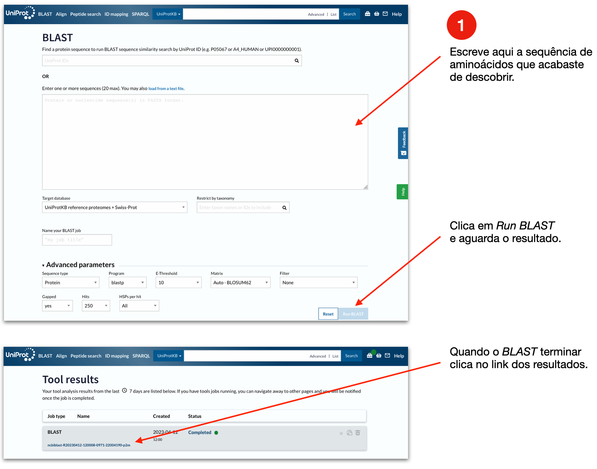
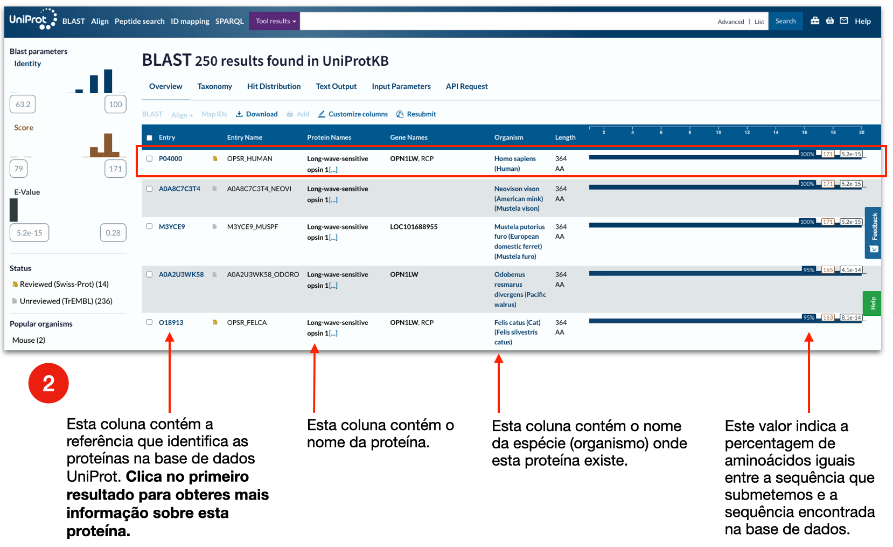
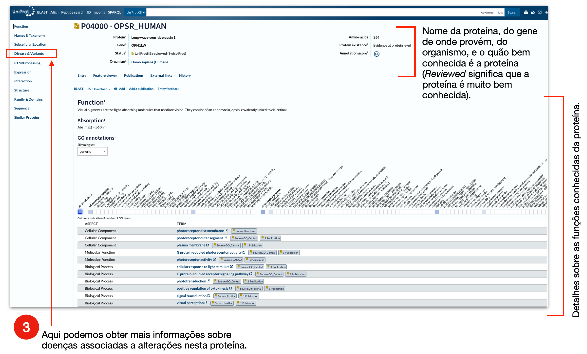

```{r setup, include=FALSE}
library(learnr)
knitr::opts_chunk$set(echo = FALSE)
```

## Bioinformática: Descobrindo genes e proteínas | 11º e 12º Ano

### Recorda que:

- Todos os organismos vivos são constituídos por **células**.

- As células eucariotas possuem o seu material genético organizado em
cromossomas, que por sua vez, são constitiuídos por ADN (**Á**cido
**D**esoxiribo**N**ucleico).

- O ADN é constituído por sequências de quatro nucleótidos diferentes, também
denominados ácidos nucleicos ou bases, representados pelas letras **A G T C**,
em que o A é adenina, G guanina, T timina e C citosina.

- O ADN contém a informação necessária para fazer **proteínas**, ditada pela
ordem dos 4 nucleótidos ao longo do ADN.

- Cada conjunto de **3 nucleótidos no ADN (codões)** codificam para um
aminoácido; ou então para o sinal de início da proteína (codão de iniciação:
ATG); ou para o sinal de término da proteína (codões stop: TAA, TAG ou TGA).

- O **código genético** é este mapa entre os tripletos de ADN e os aminoácidos
de uma proteína.

- As proteínas são **polímeros de aminoácidos**, isto é, são fiadas de
aminoácidos em sequência.

- Existem **20 aminoácidos** diferentes.

- Um **gene** é um segmento de ADN que (geralmente) codifica para uma única
proteína.

- Os **genes são herdados** dos pais, e determinam as características genéticas
e físicas do indivíduo.


<font size="1">Esta actividade é baseada no guião "Em busca de um gene mistério!", do Instituto Gulbenkian de Ciência (Dia Aberto IGC 2010).</font>

## Actividade | Descobrindo o Código Genético

Os **genes** codificam instruções para fazer **proteínas**. Mas como é que o
fazem?

As **proteínas** são constituídas por sequências de aminoácidos, mais ou menos
longas, tal como um colar feito de missangas. Existem 20 aminoácidos diferentes,
e cada um é representado simbolicamente por uma letra. Por exemplo, a Metionina
é representada por um M, a Leucina por um L, a Fenilalanina por um F, a Prolina
por um P, etc.

Um **gene** pode ser visto como uma sequência de letras (que representam os
nucleótidos Adenina, Timina, Citosina e Guanina) que por sua vez codificam uma
cadeia de aminoácidos: cada aminoácido numa proteína é codificado por três
nucleótidos (três letras) no ADN. A este **tripleto de ácidos nucleicos**
chama-se **codão**. Por exemplo, as letras TGC no ADN codificam o aminoácido
Cisteína, enquanto que as letras TGG codificam para o aminoácido Triptofano.

O ADN é constituído por longas fiadas de A, T, C e G, arranjados em cadeia
dupla, e enrolados em dupla hélice (Figura 1).

{width=550}

Com os quatro nucleótidos A, T, C, G existentes no ADN podemos obter muitos
arranjos diferentes, em grupos de 3, por forma a codificar todos os aminoácidos
possíveis (uma vez que cada aminoácido é codificado por três nucleótidos).


> **Vamos pensar juntos.** Então, quantos arranjos diferentes, em grupos de
3, é possível obter com os quatro nucleótidos A, T, C e G?

```{r quiz1, echo = FALSE}
question_text(
  "Quantos arranjos diferentes em grupos de 3 são possíveis com os quatro nucleótidos A, T, C e G?",
  answer("64", correct = TRUE, message = "Correto! Existem 4 opções (A, T, C e G) para cada uma das três posições. Assim, existem 4 opções para a primeira posição, vezes 4 opções para a segunda posição, vezes 4 opções para a terceira posição. Ou seja: 4x4x4=64."),
  incorrect = "Pensa melhor. Como se calculam arranjos? É o número de opções possíveis para cada uma das posições do arranjo. Neste caso, são 4 opções (um A, um T, um C ou um G) para cada uma das três posições do codão (tripleto).",
  allow_retry = TRUE
)
```


Como viste, o número de combinações possível é muito maior do que o número total
de aminócidos diferentes (que são apenas 20). Assim sendo, algumas combinações
diferentes codificam para o mesmo aminoácido. Por exemplo, GAA e GAG ambos
codificam para o aminoácido Glutamato, cujo símbolo é a letra E.

Muito importante é também o facto de que existem 4 codões com significados
especiais.

- O codão **ATG, codifica para a Metionina**, mas significa também o início de
uma proteína. Assim sendo, o primeiro aminoácido de todas as proteínas (salvo
raras exceções) é uma Metionina. Este codão também se chama codão de iniciação
ou **codão START**.

- Os **codões TAA, TAG e TGA não codificam para qualquer aminoácido**. No
entanto são extremamente importantes para a célula pois são responsáveis por
indicar o fim da proteína, ou seja, indicam onde deve parar a leitura da
proteína no ADN. Estes codões denominam-se **codão STOP**.


## Actividade | Descobre o gene mistério

<br>

**Sabias que...** 

- A sequência do **Genoma Humano** foi apenas conhecida em Abril de 2003, custou
mil milhões de dólares, e demorou 13 anos? Hoje, quase 20 anos depois,
conseguimos sequenciar genomas humanos em apenas duas horas por cerca de 1000
dólares.

- O ADN humano tem cerca de **3 mil milhões** (3.000.000.000) de nucleótidos?

- O ADN humano codifica cerca de **25 mil** (25.000) genes?

- O ser humano possui **23 pares de cromossomas**: 22 pares de cromossomas
somáticos (1 até 22), e 1 par de cromossomas sexuais (X e Y)?


<br>

#### **Descobre o codão de iniciação - o primeiro *ATG* - na sequência deste gene mistério.**

`CCATGGTGGTGGTGATGATCTTTGCGTACTGCGTCTGCTGGGGACCCTACACCTTCTTCGCA`

<br>

#### **Descodifica a informação do ADN** que se segue ao primeiro ATG, de forma a transformá-lo na sequência de uma proteína, e responde à pergunta seguinte, usando a **Roda do Código Genético** que te será formecida na sala (Figura 2). Cada 3 nucleótidos codificam 1 aminoácido.

<br>

|   Posição  |  1  |  2  |  3  |  4  |  5  |  6  |  7  |  8  |  9  |  10 |  11 |  12 |  13 |  14 |  15 |  16 |  17 |  18 |  19 |  20 |
|:----------:|:---:|:---:|:---:|:---:|:---:|:---:|:---:|:---:|:---:|:---:|:---:|:---:|:---:|:---:|:---:|:---:|:---:|:---:|:---:|:---:|
|    Codão   | ATG | GTG | GTG | GTG | ATG | ATC | TTT | GCG | TAC | TGC | GTC | TGC | TGG | GGA | CCC | TAC | ACC | TTC | TTC | GCA |


{width=500px, height=500px}

<br>

```{r quiz2, echo = FALSE}
question_text(
  "Escreve aqui a sequência da proteína que encontraste, começando no primeiro aminoácido M. (Usa por favor uma letra por aminoácio, em letras maiúsculas e sem espaços entre as letras).",
  answer("MVVVMIFAYCVCWGPYTFFA", correct = TRUE, message = "Correto! Fizeste um bom trabalho. Por favor copia a sequência MVVVMIFAYCVCWGPYTFFA porque vais precisar dela na próxima secção."),
  answer("mvvvmifaycvcwgpytffa", correct = TRUE, message = "Correto! Fizeste um bom trabalho.  Por favor copia a sequência MVVVMIFAYCVCWGPYTFFA porque vais precisar dela na próxima secção."),
  incorrect = "Humm... Provavelmente enganaste-te na conversão de um ou outro aminoácido. Não te esqueças de escrever letras maiúsculas e sem espaços entre as letras. Aqui fica o início: MVVVMIFAYCVCWGPY... Só faltam os últimos 4 aminoácidos.",
  allow_retry = TRUE
)
```

## Actividade | Descobre a proteína codificada pelo gene

#### **Qual a proteína que é constituída pelos aminoácidos que acabaste de identificar?**

Para tal, usarás uma das muitas bases de dados onde as sequências de ADN e de
proteínas se encontram guardadas, e que podem ser livremente consultadas online.
Estes repositórios de dados possibilitam a comparação entre as nossas sequências
de interesse e todas as outras sequências anteriormente estudadas, e que foram
colocadas nestes repositórios pela comunidade científica mundial. Os cientistas
que desenvolvem os programas que permitem recolher, armazenar e analisar estes
dados biológicos chamam-se **bioinformáticos**.

NOTA: Estas ferramentas bioinformáticas foram desenvolvidas para serem
utilizadas por cientistas em todo o mundo, pelo que se encontram escritas em
inglês. Se tiveres dificuldades em navegar estas páginas, por favor pede ajuda a
um dos tutores.

Para esta tarefa usarás uma base de dados de proteínas chamada **UniProt** e um
programa chamado **BLAST**, que te permitirá procurar na base de dados
sequências semelhantes à tua proteína de interesse.

**Intruções:** Abre um novo separador e acede ao seguinte endereço:
https://www.uniprot.org/blast, e segue as instruções da Figura 3.

{width=100%}

<br>

#### **Resultados da pesquisa BLAST**

Após a pesquisa por BLAST de sequências idênticas à proteína de interesse, isto é, a proteína encontrada no sangue do assaltante do banco que pode ajudar a identificar o suspeito culpado do crime, encontramos a seguinte página de resultados:

{width=100%}

<br>

```{r quiz3, echo = FALSE}
quiz(caption = "Usando as informações apresentadas no cabeçalho da página, vê se consegues responder às seguintes questões:",
  question_text("Qual o nome da proteína mistério? (Podes copiar o nome em inglês exatamente como está apresentado na página web).",
    answer("Long-wave-sensitive opsin 1", correct = TRUE, message = "Correto! Esta proteína é a Opsina 1 sensível a comprimentos de onda longos."),
  incorrect = "Confirma que copiaste todo o nome corretamente.",
  allow_retry = TRUE
  ),
  question_text("Qual o organismo que possui esta proteína? (Copia apenas as duas palavras referentes ao nome em latim do organismo).",
    answer("Homo sapiens", correct = TRUE, message = "Correto! Esta proteína existe no ser humano."),
  incorrect = "Confirma que copiaste corretamente todo o nome do organismo.",
  allow_retry = TRUE
  ),
  question_text("Qual o nome do gene codifica esta proteína (*Gene*)?",
    answer("OPN1LW", correct = TRUE, message = "Correto! Esta proteína é codificada pelo gene OPN1LW."),
  incorrect = "Confirma que copiaste todo o nome do gene corretamente.",
  allow_retry = TRUE
  )
)
```

## Actividade | Descobre a função da proteína

#### **Qual a função da proteína que acabaste de identificar?**

A UniProt é uma espécie de enciclopédia sobre proteínas. Toda a informação sobre
cada uma das proteínas cuja sequência de aminoácidos é já conhecida é guardada
aqui. Uma entrada na UniProt tem o seguinte aspecto (Figura 5):

{width=100%}

<br>

```{r quiz4, echo = FALSE}
quiz(caption = "Explora um pouco mais as informações apresentadas na página desta proteína, e responde às seguintes questões:",
  question_text("A função desta proteína está associada a que órgão dos sentidos humano? (Pista: Lembra-te dos 5 sentidos humanos: visão, audição, olfato, gosto e tato). (Por favor escreve em minúsculas e sem pontuação.)",
    answer("olho", correct = TRUE, message = "Correto! Esta proteína encontra-se expressa nos olhos e está associada à visão."),
    answer("olhos", correct = TRUE, message = "Correto! Esta proteína encontra-se expressa nos olhos e está associada à visão."),
    answer("OLHO", correct = TRUE, message = "Correto! Esta proteína encontra-se expressa nos olhos e está associada à visão."),
    answer("OLHOS", correct = TRUE, message = "Correto! Esta proteína encontra-se expressa nos olhos e está associada à visão."),
  incorrect = "Humm... vamos pensar juntos: então se esta proteína está associada à visão, então em qual órgão dos sentidos estará expressa?",
  allow_retry = TRUE
  ),
  question_text("Quantas doenças estão descritas como estando associadas a mutações nesta proteína? (Pista: Esta informação encontra-se na secção Disease & Variants.) (Escreve apenas um número).",
    answer("2", correct = TRUE, message = "Correto! Mutações nesta proteína estão descritas como estando associadas a duas doenças."),
  incorrect = "Confirma que leste corretamente a secção sobre Disease & Variants.",
  allow_retry = TRUE
  ),
  question_text("Dá exemplo de uma doença causada por alterações nesta proteína. (Copia o nome da doença em inglês, tal como se encontra no website).",
    answer("Colorblindness, partial, protan series (CBP)", correct = TRUE, message = "Correto! O daltonismo parcial está associado a defeitos nesta proteína."),
    answer("Blue cone monochromacy (BCM)", correct = TRUE, message = "Correto! O daltonismo monocromático azul (raro e muito debilitante) está associado a defeitos nesta proteína."),
  incorrect = "Confirma que leste corretamente a secção sobre Disease & Variants. E coloca o nome da doença de forma completa como aparece no website.",
  allow_retry = TRUE
  )
)
```

## Actividade | Estrutura 3D da proteína

<br>

#### **Como posso ver a estrutura 3D da proteína mistério?**

<br>

**Sabias que...** 

- A função de uma proteína está altamente associada à sua configuração
tri-dimensional (denominada estrutura terciária)?

- A mutação num gene pode alterar a configuração da proteína e causar a sua
perda de função?

- A configuração 3D de uma proteína é maioritariamente determinada pela
identidade e ordem dos seus aminoácidos?

<br>

#### Existem várias bases de dados com informações sobre a estrutura das proteínas. Nesta actividade, pela limitação de tempo, em vez de pesquisarmos dados usando a sequência proteica, apresentamos aqui a estrutura tridimensional da opsina 1.

<br>

#### **Para veres, em 3D**

Fizemos aqui na UAlg um vídeo mostrando a estrutura em 3D da proteína que
estiveste a estudar (vídeo feito na UAlg pelo Prof. Paulo Martel). Utiliza os
óculos 3D fornecidos pelos tutores na sala.

{width="90%"}

<br>

O identificador da nossa proteína mistério é 1KPX, e podes interagir com a
estrutura no seguinte endereço:
https://www.ebi.ac.uk/thornton-srv/databases/cgi-bin/pdbsum/GetPage.pl?pdbcode=1kpx&template=3Dmoljsbox.html

<br>

#### **Mais sobre estrutura de proteínas**

As longas cadeias de aminoácidos codificadas pelos genes podem assumir
diferentes configurações, como por exemplo em hélices alfa (*alpha helices*) ou
cadeias beta pregueadas (*beta sheets*). Isto é possível uma vez que cada
aminoácido possui **propriedades físico-químicas diferentes**. Alguns têm
**carga elétrica** negativa e outros carga positiva, atraíndo-se mutuamente,
como por exemplo o aminoácido glutamato e a lisina. Outros, como a leucina e a
Valina, são **hidrofóbicos** (repelem a água), e como tal tendem a ficar no
interior da estrura proteica onde ficam pouco expostos a água.

Assim, proteínas com sequências de aminoácidos diferentes originam configurações
3D diferentes.

<br>

<center>
{width=75px}


